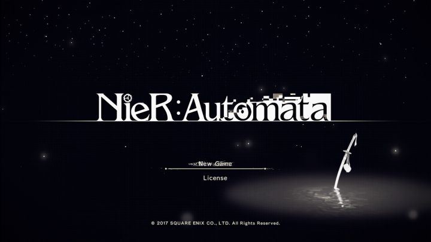

2018年2月23日
=============
##  人类永远改不掉的毛病，叫做傲慢与偏见。

1.  问：当卷积核为100\*100时，如何优化均值滤波算法？
答：卷积核在图像中是以步长为1滑动的，那么只需要计算起始的100\*100像素的均值，后续的均值可以通过后一个步长最右一列100像素与前一个步长最左100像素的差值除以100构成的增量来计算当前步的均值。为使滑动过程具有连续性，卷积核在图像上进行“Z"字型滑动。  

2.  python闭包  
    必须是一个嵌套的函数。
    闭包必须返回嵌套函数。
    嵌套函数必须引用一个外部的非全局的局部自由变量。

    举例：
    <pre>def create():
        return [lambda x:i*x for i in range(5)]</pre>
        
    <pre>for i in create():
        print(i(2))</pre>
        最终答案是 8 8 8 8 8。create()返回的是列表对象，该对象有5个元素，每个元素为一个匿名函数（lambda的作用），在for循环运行的同时，提供i的变量引用。由于延迟绑定的特性，当for循环结束之后，i指向的值为4，这之后才开始计算i(2)，于是结果是5个8。  
        如何修改？  
    <pre>def create():
        return [lambda x,a=i:a*x for i in range(5)]</pre>   
        添加a=i，相当于给匿名函数添加了默认参数，每当python解释器遇到lambda关键字时，都要初始化这个默认参数，每次循环，默认参数a都要找一次引用，第一次为0，后面为1,2,3,4。
        
        
3.  为什么输出运算符重载不能是一个成员函数?而非得声明为友元？ 

    输出运算符重载函数的第一个形参必须是ostream或istream类型，而成员函数的第一个形参是默认的（即this指针）。另外，输出运算符必须返回引用是因为无法复制IO对象，即iostream对象不能作为右值返回，因此只能返回引用。