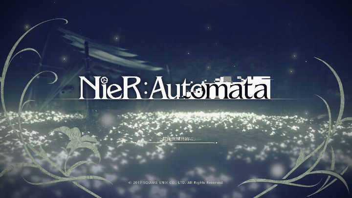

2018年2月24日
=============
##  如果你的自信心轻易就被击碎了，那它应该改名叫玻璃心。

1.  《C++ Primer》： 关于栈适配器：stack类型定义在stack头文件中，栈默认基于deque(双端队列）实现，也可在list(双向链表)或vector之上实现。基本操作如下：

    +   s.pop():删除栈顶元素，但不返回该元素值
    +   s.push(item):创建一个新元素压入栈顶，该元素通过拷贝或移动item而来
    +   s.emplace(args):由args构造一个元素压入栈顶，传递给emplace函数的参数必须与元素类型的构造函数相匹配
    +   s.top():返回栈顶元素，但不弹出