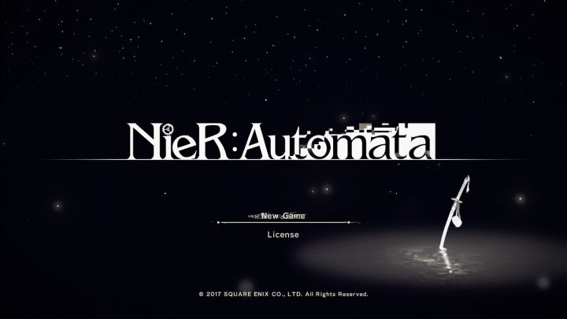

2018年3月6日
=============

##  学习就三步，模仿，理解，超越。

1.  while是先判断后执行；而do...while至少执行一次后再判断。

2.  求vector的最大值：

    `int max = *max_element(v.begin(),v.end());`
    
    最小值：
    
    `int min = *min_element(v.begin(),v.end());`
    
3.  https://github.com/facebookresearch/Detectron#references

4.  交并比（Intersection-over-Union，IoU），目标检测中使用的一个概念，是产生的候选框（candidate bound）与原标记框（ground truth bound）的交叠率，即它们的交集与并集的比值。最理想情况是完全重叠，即比值为1。

5.  圆周卷积与线性卷积之间的关系：当有限长序列x(n)和h(n)的长度分别为N1和N2，取N>=max(N1,N2)，当N>=N1+N2-1，则线性卷积与圆周卷积相同。圆周卷积是周期卷积的主值序列；周期卷积是线性卷积的周期延拓。如果以大于序列长度进行周期延拓，则多余部分补零；否则将发生混叠现象。

6.  多尺度与多分辨率：自然界中的物体呈现出不同的形态，需要不同的尺度观测。比如，建筑物用“米”测量，原子用“纳米”。比较形象的是，在平常使用的Google地图，可以滑动鼠标来改变地图的尺度；照相机通过调焦，将景物拉近拉远。尺度空间中各尺度图像的模糊程度逐渐变大，模拟了景物由近到远在视网膜形成过程。
    1. 高斯核是唯一可以产生多尺度空间的核；

    2. 一幅图像的尺度空间 L(x, y, σ), 定义为原始图像 I(x,y) 与一个可变尺度的2维高斯函数G(x, y, σ)卷积运算。
    
    尺度空间表达是由不同高斯核平滑卷积得到，在所有尺度上有相同的分辨率；
    而（金字塔）多分辨率表达每层分辨率减少固定比率。
    
7.  SIFT: 组数和尺度数依赖于原始图像的大小，SIFT算法发明者建议将组数设为4，尺度数设为5是比较理想的。在实现中我们采用作者的建议。第一组的图像并不是直接使用原始图像，而是使用大小放大两倍并稍微模糊后的图像，这样可以多产生4倍的特征点。